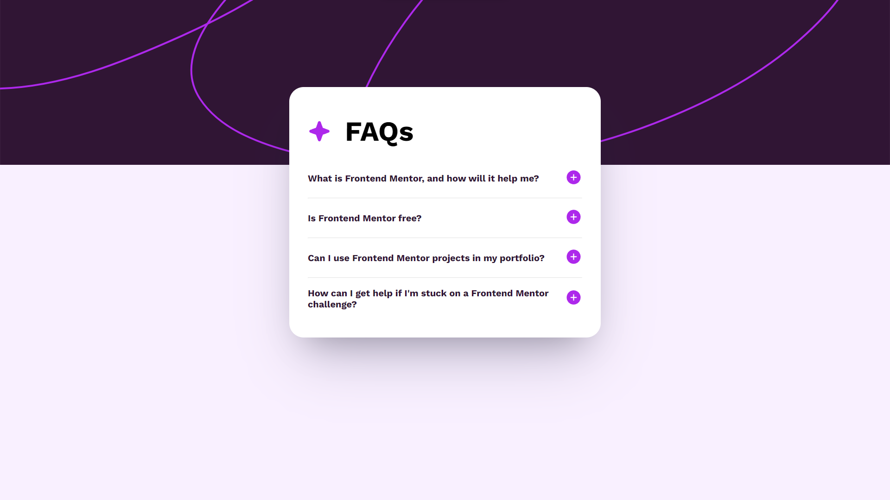
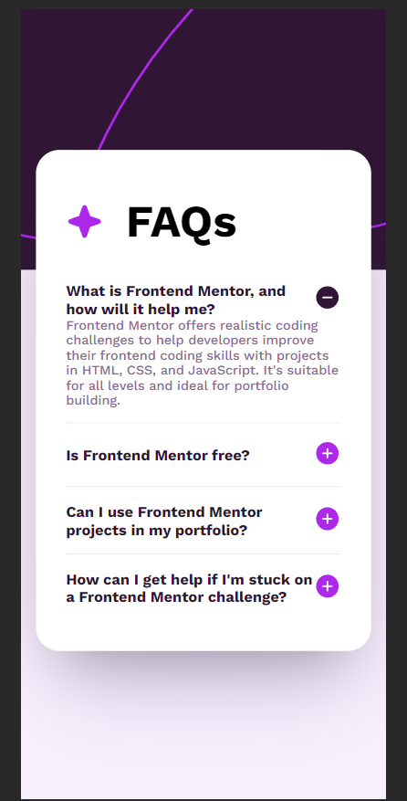

# Frontend Mentor - FAQ accordion solution

This is a solution to the [FAQ accordion challenge on Frontend Mentor](https://www.frontendmentor.io/challenges/faq-accordion-wyfFdeBwBz). Frontend Mentor challenges help you improve your coding skills by building realistic projects. 

## Table of contents

- [Overview](#overview)
  - [The challenge](#the-challenge)
  - [Screenshot](#screenshot)
  - [Links](#links)
- [My process](#my-process)
  - [Built with](#built-with)
  - [What I learned](#what-i-learned)
  - [Continued development](#continued-development)
  - [Useful resources](#useful-resources)
- [Author](#author)
- [Acknowledgments](#acknowledgments)

**Note: Delete this note and update the table of contents based on what sections you keep.**

## Overview

### The challenge

Users should be able to:

- Hide/Show the answer to a question when the question is clicked
- Navigate the questions and hide/show answers using keyboard navigation alone
- View the optimal layout for the interface depending on their device's screen size
- See hover and focus states for all interactive elements on the page

### Screenshot

### Links

- Solution URL: [Github-solution-url](https://github.com/vashu-kashyap/FAQ-accordion-by-frontend-mentor)
- Live Site URL: [Netlify-live-solution](https://your-live-site-url.com)

## My process

### Built with

- Semantic HTML5 markup
- CSS custom properties
- Flexbox

### What I learned

In this project, I acquired skills in creating an accordion using HTML, CSS, and JavaScript. I learned to structure HTML for the accordion, style it with CSS, and implement interactivity through JavaScript. Additionally, I focused on accessibility considerations, incorporating ARIA attributes. This project enhanced my understanding of web development and the seamless integration of these technologies to build dynamic user interfaces.

## Author

- Linkedin - [@im-vashukashyap](https://www.linkedin.com/in/im-vashukashyap/)
- Instagram - [@im.vashukashyap](https://www.instagram.com/im.vashukashyap/)
- linketree - [@yourusername](https://www.twitter.com/yourusername)

